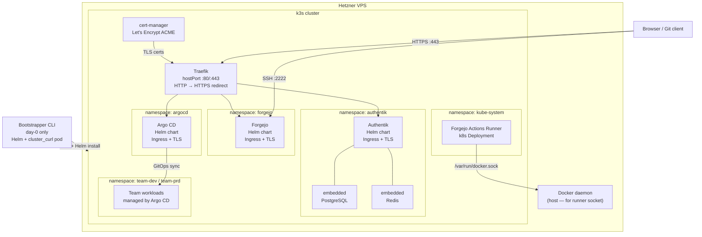

# Bootstrapper

A CLI tool that provisions a fully self-hosted, European developer platform in a single command. It spins up a Hetzner VPS, installs [k3s](https://k3s.io/), and deploys [Forgejo](https://forgejo.org/) (git hosting), [Authentik](https://goauthentik.io/) (identity provider), and [Argo CD](https://argo-cd.readthedocs.io/) (GitOps) as Helm charts — all behind [Traefik](https://traefik.io/) with automatic Let's Encrypt TLS via [cert-manager](https://cert-manager.io/). SSO between all services is wired automatically.

Part of a larger vision: a fully EU-sovereign Internal Developer Platform (IDP) modelled on Azure DevOps + Entra ID + AKS, but running entirely under EU law with open-source components. The bootstrapper is a one-shot day-0 tool — run it once to hand a platform team a live, GitOps-ready foundation.

## Architecture

### New architecture (current)

Everything runs inside k3s. Traefik (built into k3s) handles ingress on host ports 80/443. cert-manager handles Let's Encrypt. Forgejo, Authentik, and Argo CD are Helm charts. The bootstrapper is day-0 only — after provisioning, all operations go through Argo CD GitOps.


## Stack

| Service | Role | Origin |
|---|---|---|
| [Hetzner Cloud](https://www.hetzner.com/cloud) | VPS provider | 🇩🇪 Germany |
| [Forgejo](https://forgejo.org/) | Git hosting (Gitea fork) | 🇩🇪 Germany (Codeberg e.V.) |
| [Authentik](https://goauthentik.io/) | Identity provider, SSO, OIDC | 🇩🇪 Germany (BeryTech) |
| [k3s](https://k3s.io/) | Lightweight Kubernetes runtime | Open source |
| [Traefik](https://traefik.io/) | Ingress controller (built into k3s) | Open source |
| [cert-manager](https://cert-manager.io/) | Automatic Let's Encrypt TLS | Open source |
| [Argo CD](https://argo-cd.readthedocs.io/) | GitOps continuous delivery | Open source |
| [Forgejo Actions runner](https://forgejo.org/docs/latest/user/actions/) | CI/CD execution in k3s | Open source |

## What it does

Running `bootstrapper provision` performs six steps:

1. **Provision** — creates a Hetzner Cloud VPS (or reuses one from state)
2. **Runtime** — installs Docker Engine (for the runner socket) and k3s (Traefik on host ports 80/443)
3. **Install services** — installs Helm, cert-manager + ClusterIssuer, Forgejo, and Authentik as Helm charts (--wait)
4. **Configure** — starts a temporary curl pod inside the cluster; configures Forgejo admin, API token, Authentik OAuth2 provider + groups, and wires SSO between them; tears down the curl pod
5. **GitOps layer** — installs Argo CD via Helm, configures Authentik SSO for Argo CD, configures k3s OIDC, and deploys the Forgejo Actions runner
6. **Seed platform-config** — creates the `platform-team` Forgejo org and a `platform-config` repo pre-seeded with landing zone pipeline templates

Re-running is fully idempotent: the server, secrets, and API objects are all reused or patched in place.

## Prerequisites

- Python 3.11+
- A [Hetzner Cloud](https://www.hetzner.com/cloud) account and API token
- An SSH key pair
- DNS A records pointing to your server (add these after the first run when the IP is printed):
  - `git.yourdomain.nl` → server IP
  - `iam.yourdomain.nl` → server IP
  - `argocd.yourdomain.nl` → server IP

## Installation

```bash
git clone https://github.com/NSavenije/Bootstrapper.git
cd Bootstrapper
python -m venv .venv
source .venv/bin/activate   # Windows: .venv\Scripts\activate
pip install -e .
```

## Configuration

Copy the example config and fill in your values:

```bash
cp config.example.yaml config.yaml
```

Key fields:

```yaml
api_token: "YOUR_HETZNER_API_TOKEN"
ssh_key: "your-key.pub"
ssh_private_key: "your-key"
server_type: cpx21        # run: bootstrapper server-types  to list options
location: nbg1            # nbg1 (Nuremberg), fsn1 (Falkenstein), hel1 (Helsinki)

forgejo:
  admin_username: "siteadmin"   # avoid reserved names: admin, root, git
  admin_password: "CHANGE_ME"
  domain: "git.yourdomain.nl"
  email: "admin@yourdomain.nl"

authentik:
  admin_password: "CHANGE_ME"
  domain: "iam.yourdomain.nl"
  email: "admin@yourdomain.nl"

argocd_domain: "argocd.yourdomain.nl"
```

> **Never commit `config.yaml`** — it contains secrets. It is gitignored by default.

## Usage

```bash
# Provision everything
bootstrapper provision --config config.yaml

# List available Hetzner server types
bootstrapper server-types --api-token YOUR_TOKEN
```

After a successful run, add the DNS A records printed in the summary. Traefik and cert-manager obtain Let's Encrypt TLS certificates automatically on the first request.

## Post-provisioning

### Configure platform-config repo secrets

The seeded `platform-team/platform-config` repo contains a Forgejo Actions pipeline that provisions team landing zones. It needs two repo-level secrets (Settings → Actions → Secrets):

| Secret | Value | Generation |
|---|---|---|
| `KUBECONFIG` | Contents of `/etc/rancher/k3s/k3s.yaml` on the server | ssh -i <path/to/private/key> "cat /etc/rancher/k3s/k3s.yaml" \| base64 -w0 |
| `PLATFORM_TOKEN` | A Forgejo API token with `write:organization` + `write:admin` scopes | git.<yourdomain>.nl/user/settings/applications |

## Landing zones

The platform-config repo ships a `.forgejo/workflows/provision-team.yml` pipeline. Adding a YAML file under `teams/` and merging the PR provisions a full landing zone:

- Two Kubernetes namespaces: `<team>-dev` (Argo CD auto-sync) and `<team>-prd` (manual sync)
- RBAC Role + RoleBindings (Authentik OIDC group + CI ServiceAccount)
- Argo CD AppProject scoped to the team's namespaces
- Forgejo organisation for the team
- Argo CD ApplicationSet with SCM generator — auto-discovers team repos and deploys their `k8s/` manifests

App teams never touch platform-config. This is the handoff from bootstrapper to the platform team — no CLI commands needed for ongoing operations.

## State file

`.bootstrapper-state.yaml` is created on first run and stores the server IP, server ID, generated secrets, and API tokens. Re-running reads from it to skip already-provisioned resources. Keep it safe and gitignored.

## Project structure

```
app.py                          entry point
bootstrapper/
  cli.py                        Click commands (provision, server-types)
  config.py                     config loading and validation
  secrets.py                    secret generation and state persistence
  backends/
    base.py                     InfrastructureBackend abstract class
    hetzner.py                  Hetzner Cloud provisioning (hcloud SDK)
    local.py                    local/no-op backend for dev/testing
  deploy/
    ssh.py                      paramiko SSH helpers + cluster_curl (curl pod pattern)
    docker.py                   Docker Engine install
    helm.py                     Helm install, repo management, upgrade_install
  services/
    forgejo.py                  Forgejo API client (admin user, token, runner token, org)
    authentik.py                Authentik API client (OAuth2 provider, groups, akadmin sync)
    k8s.py                      k3s, cert-manager, Forgejo/Authentik/Argo CD Helm installs, OIDC
    sso.py                      Forgejo ↔ Authentik SSO wiring
  templates/
    k8s/
      runner.yaml.j2            Forgejo Actions runner Deployment + PVC
    platform-config/
      README.md                 Platform team onboarding guide
      .forgejo/workflows/
        provision-team.yml      Landing zone pipeline
      k8s-templates/            sed-substitution templates for namespace/RBAC/AppProject
      teams/
        .gitkeep                Drop team YAML files here
```

## Recovering Authentik admin access

If you lose access to the `akadmin` account, SSH to the server and run:

```bash
kubectl exec -n authentik deploy/authentik-server -- ak create_recovery_key 1 akadmin
```

Visit the printed URL at `https://iam.yourdomain.nl/recovery/use-token/...` to set a new password.
