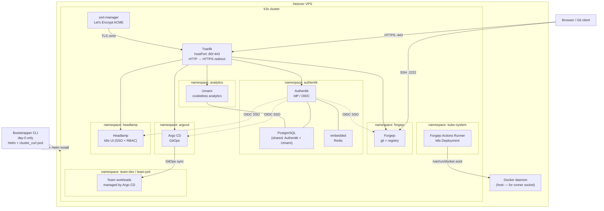

# Bootstrapper

A CLI tool that provisions a fully self-hosted, European developer platform in a single command. It spins up a Hetzner VPS, installs [k3s](https://k3s.io/), and deploys [Forgejo](https://forgejo.org/) (git hosting), [Authentik](https://goauthentik.io/) (identity provider), and [Argo CD](https://argo-cd.readthedocs.io/) (GitOps) as Helm charts — all behind [Traefik](https://traefik.io/) with automatic Let's Encrypt TLS via [cert-manager](https://cert-manager.io/). SSO between all services is wired automatically.

Three further services are provisioned when their domain is configured: [Headlamp](https://headlamp.dev/) (a Kubernetes web UI behind Authentik SSO, with cluster access mapped from your OIDC groups), [Umami](https://umami.is/) (cookieless, consent-banner-free analytics), and a friendly `portal.<domain>` redirect to the Authentik app dashboard.

Part of a larger vision: a fully EU-sovereign Internal Developer Platform (IDP) modelled on Azure DevOps + Entra ID + AKS, but running entirely under EU law with open-source components. The bootstrapper is a one-shot day-0 tool — run it once to hand a platform team a live, GitOps-ready foundation.

## Architecture

Everything runs inside k3s. Traefik (built into k3s) handles ingress on host ports 80/443. cert-manager handles Let's Encrypt. Forgejo, Authentik, Argo CD, Headlamp, and Umami are Helm charts. The bootstrapper is day-0 only — after provisioning, all operations go through Argo CD GitOps (see [Day-2 operations](#day-2-operations)).


```mermaid
graph TB
    User["Browser / Git client"]

    subgraph VPS["Hetzner VPS"]
        DockerD["Docker daemon<br/>(host — for runner socket)"]

        subgraph k3s["k3s cluster"]
            Traefik["Traefik<br/>hostPort :80/:443<br/>HTTP → HTTPS redirect"]
            CertMgr["cert-manager<br/>Let's Encrypt ACME"]

            subgraph forgejo-ns["namespace: forgejo"]
                Forgejo["Forgejo<br/>git + registry"]
            end

            subgraph authentik-ns["namespace: authentik"]
                Authentik["Authentik<br/>IdP / OIDC"]
                AuthPG["PostgreSQL<br/>(shared: Authentik + Umami)"]
                AuthRedis["embedded<br/>Redis"]
            end

            subgraph argocd-ns["namespace: argocd"]
                ArgoCD["Argo CD<br/>GitOps"]
            end

            subgraph headlamp-ns["namespace: headlamp"]
                Headlamp["Headlamp<br/>k8s UI (SSO + RBAC)"]
            end

            subgraph analytics-ns["namespace: analytics"]
                Umami["Umami<br/>cookieless analytics"]
            end

            subgraph kube-system["namespace: kube-system"]
                Runner["Forgejo Actions Runner<br/>k8s Deployment"]
            end

            subgraph teams["namespace: team-dev / team-prd"]
                TeamApps["Team workloads<br/>managed by Argo CD"]
            end
        end
    end

    Bootstrap["Bootstrapper CLI<br/>day-0 only<br/>Helm + cluster_curl pod"]

    User -->|"HTTPS :443"| Traefik
    User -->|"SSH :2222"| Forgejo
    Traefik --> Forgejo
    Traefik --> Authentik
    Traefik --> ArgoCD
    Traefik --> Headlamp
    Traefik --> Umami
    CertMgr -->|"TLS certs"| Traefik
    Authentik --- AuthPG
    Authentik --- AuthRedis
    Umami --- AuthPG
    Authentik -.->|"OIDC SSO"| Forgejo
    Authentik -.->|"OIDC SSO"| ArgoCD
    Authentik -.->|"OIDC SSO"| Headlamp
    ArgoCD -->|"GitOps sync"| TeamApps
    Runner -->|"/var/run/docker.sock"| DockerD
    Bootstrap -->|"SSH + Helm install"| k3s
```
## Stack

| Service | Role | Origin |
|---|---|---|
| [Hetzner Cloud](https://www.hetzner.com/cloud) | VPS provider | 🇩🇪 Germany |
| [Forgejo](https://forgejo.org/) | Git hosting (Gitea fork) | 🇩🇪 Germany (Codeberg e.V.) |
| [Authentik](https://goauthentik.io/) | Identity provider, SSO, OIDC | 🇩🇪 Germany (BeryTech) |
| [k3s](https://k3s.io/) | Lightweight Kubernetes runtime | Open source |
| [Traefik](https://traefik.io/) | Ingress controller (built into k3s) | Open source |
| [cert-manager](https://cert-manager.io/) | Automatic Let's Encrypt TLS | Open source |
| [Argo CD](https://argo-cd.readthedocs.io/) | GitOps continuous delivery | Open source |
| [Forgejo Actions runner](https://forgejo.org/docs/latest/user/actions/) | CI/CD execution in k3s | Open source |
| [Headlamp](https://headlamp.dev/) | Kubernetes web UI (SSO + per-user RBAC) | Open source (CNCF) |
| [Umami](https://umami.is/) | Cookieless, consent-free web analytics | Open source |

## What it does

Running `bootstrapper provision` performs six steps:

1. **Provision** — creates a Hetzner Cloud VPS (or reuses one from state)
2. **Runtime** — installs Docker Engine (for the runner socket) and k3s (Traefik on host ports 80/443)
3. **Install services** — installs Helm, cert-manager + ClusterIssuer, Forgejo, and Authentik as Helm charts (--wait)
4. **Configure** — starts a temporary curl pod inside the cluster; configures Forgejo admin, API token, Authentik OAuth2 provider + groups, and wires SSO between them; tears down the curl pod
5. **GitOps layer** — installs Argo CD via Helm, configures Authentik SSO for Argo CD, configures k3s OIDC, and deploys the Forgejo Actions runner. If their domains are set, also installs **Headlamp** (Kubernetes UI, SSO + RBAC bound to your OIDC groups), the **portal** redirect, and **Umami** analytics (with its admin password rotated off the shipped default)
6. **Seed platform-config** — creates the `platform-team` Forgejo org and a `platform-config` repo pre-seeded with landing zone pipeline templates

Re-running is fully idempotent: the server, secrets, and API objects are all reused or patched in place.

Optional services are only installed when their domain is present in `config.yaml` (`headlamp_domain`, `portal_domain`, `analytics_domain`). Each can also be added later to a running platform via its own command — see [Usage](#usage).

## Prerequisites

- Python 3.11+
- A [Hetzner Cloud](https://www.hetzner.com/cloud) account and API token (not needed for the local provider)
- An SSH key pair, stored outside the repo (e.g. in `~/.ssh`)
- DNS A records pointing to your server (add these after the first run when the IP is printed):
  - `git.yourdomain.nl` → server IP
  - `iam.yourdomain.nl` → server IP
  - `argocd.yourdomain.nl` → server IP
  - optional, one per enabled service: `headlamp.` / `portal.` / `stats.yourdomain.nl` → server IP

## Installation

```bash
git clone https://github.com/NSavenije/Bootstrapper.git
cd Bootstrapper
python -m venv .venv
source .venv/bin/activate   # Windows: .venv\Scripts\activate
pip install -e .
```

## Configuration

Copy the example config and fill in your values:

```bash
cp config.example.yaml config.yaml
```

Key fields:

```yaml
provider: hetzner         # hetzner or local
api_token: "YOUR_HETZNER_API_TOKEN"

# Keep keys outside the repo (e.g. in ~/.ssh) and reference them by absolute path.
ssh_key: "/path/to/your/.ssh/your-key.pub"
ssh_private_key: "/path/to/your/.ssh/your-key"

server_type: cpx21        # run: bootstrapper server-types  to list options
location: nbg1            # nbg1 (Nuremberg), fsn1 (Falkenstein), hel1 (Helsinki)

forgejo:
  admin_username: "siteadmin"   # avoid reserved names: admin, root, git
  admin_password: "CHANGE_ME"
  domain: "git.yourdomain.nl"
  email: "admin@yourdomain.nl"

authentik:
  admin_password: "CHANGE_ME"
  domain: "iam.yourdomain.nl"
  email: "admin@yourdomain.nl"
  admin_group: "forgejo-admins" # members get Forgejo admin rights via SSO
  groups:                       # groups to create in Authentik (idempotent)
    - forgejo-admins
    - platform-devs

argocd_domain: "argocd.yourdomain.nl"   # required; Argo CD web UI

# Optional services — each is installed only if its domain is set:
headlamp_domain: "headlamp.yourdomain.nl"   # Kubernetes web UI (Authentik SSO + RBAC)
portal_domain: "portal.yourdomain.nl"       # friendly redirect to the Authentik dashboard
analytics_domain: "stats.yourdomain.nl"     # Umami cookieless analytics
blog_domain: "blog.yourdomain.nl"           # only included in the DNS summary
```

The optional `headlamp_domain`, `portal_domain`, and `analytics_domain` map cluster access and analytics onto their own subdomains. See `config.example.yaml` for the full annotated set.

> **Never commit `config.yaml`** — it contains secrets. All `config*.yaml` files are gitignored by default (only `config.example.yaml` is tracked).

### Local provider (WSL2 / any SSH-reachable host)

For development you can provision into a local machine instead of Hetzner: set `provider: local` and point `local.host` / `local.ssh_user` at an SSH-reachable host (WSL2 works well). No cloud account or API token is needed, certificates are self-signed, and `*.127.0.0.1.nip.io` domains resolve to localhost without `/etc/hosts` edits. See the commented **Option B** section in `config.example.yaml` for the full setup, including the one-time WSL2 SSH preparation.

## Usage

```bash
# Provision everything
bootstrapper provision --config config.yaml

# After DNS propagates: wire k3s OIDC and switch the Forgejo OAuth source public
bootstrapper wire-k3s-oidc --config config.yaml

# List available Hetzner server types
bootstrapper server-types --api-token YOUR_TOKEN

# Add -v to any command to print every SSH command and its output
bootstrapper -v provision --config config.yaml
```

Add-on commands install a single service onto an already-provisioned platform (each idempotent, each wiring its own Authentik SSO where applicable):

```bash
bootstrapper install-headlamp  --config config.yaml   # Kubernetes UI (SSO + RBAC)
bootstrapper install-analytics --config config.yaml   # Umami analytics
bootstrapper install-portal    --config config.yaml   # portal.<domain> redirect
bootstrapper seed-demo-users   --config config.yaml   # one demo user per Authentik group
bootstrapper build-runner-image --config config.yaml  # rebuild + refresh the CI runner image
```

After a successful run, add the DNS A records printed in the summary. Traefik and cert-manager obtain Let's Encrypt TLS certificates automatically on the first request.

## Post-provisioning

### Configure platform-config repo secrets

The seeded `platform-team/platform-config` repo contains a Forgejo Actions pipeline that provisions team landing zones. It needs three repo-level **secrets** and two **variables** (Settings → Actions). The full, authoritative list lives in that repo's own `README.md`; the summary:

**Secrets** (Settings → Actions → Secrets):

| Secret | Value |
|---|---|
| `KUBECONFIG` | Base64 kubeconfig with the server IP substituted: `ssh root@<ip> "sed 's/127.0.0.1/<ip>/' /etc/rancher/k3s/k3s.yaml" \| base64 -w0` |
| `PLATFORM_TOKEN` | Forgejo API token, scopes `write:organization write:repository write:user write:admin` |
| `PACKAGE_PULL_TOKEN` | Forgejo API token, scopes `read:package read:user` — used for the `forgejo-registry` image-pull secret in each team namespace |

**Variables** (Settings → Actions → Variables — note the `FORGE_` prefix; names starting `FORGEJO_`/`GITEA_`/`GITHUB_` are reserved and rejected):

| Variable | Value |
|---|---|
| `FORGE_URL` | `https://git.yourdomain.nl` |
| `FORGE_DOMAIN` | `git.yourdomain.nl` |

> A regular API token cannot pull container images — `read:package` is a separate scope, which is why `PACKAGE_PULL_TOKEN` is distinct from `PLATFORM_TOKEN`.

## Landing zones

The platform-config repo ships a `.forgejo/workflows/provision-team.yml` pipeline. Adding a YAML file under `teams/` and merging the PR provisions a full landing zone:

- Two Kubernetes namespaces: `<team>-dev` (Argo CD auto-sync) and `<team>-prd` (manual sync)
- RBAC Role + RoleBindings (Authentik OIDC group + CI ServiceAccount)
- Argo CD AppProject scoped to the team's namespaces
- Forgejo organisation for the team
- Three Argo CD ApplicationSets (SCM generators) that auto-discover the org's repos and deploy their `k8s/` manifests

App teams never touch platform-config. This is the handoff from bootstrapper to the platform team — no CLI commands needed for ongoing operations.

### Per-repo sync mode

Each repo picks its deployment mode by what it commits under `k8s/`, and the three ApplicationSets are mutually exclusive so exactly one owns any given repo:

| Repo layout | Deploys to | Sync |
|---|---|---|
| `k8s/` only | `<team>-dev` **and** `<team>-prd` | dev auto-syncs; prd is a manual gate |
| `k8s/` + `k8s/.prod-only` | `<team>-prd` only | auto-sync |

The `.prod-only` marker is for single-environment apps — a site that hardcodes its production hostname has no meaningful dev copy, and deploying it to two namespaces would put two Ingresses on the same host and let Traefik pick between them. The marker opts such a repo out of `-dev` and out of the manual `-prd` gate, giving it one auto-syncing production home. It's a self-service switch: the app team adds the file, the platform is untouched.

## State file

`.bootstrapper-state.yaml` is created on first run and stores the server IP, server ID, generated secrets, and API tokens. Re-running reads from it to skip already-provisioned resources. Keep it safe and gitignored — it is the only copy of every generated password and token, and losing it means rotating all of them by hand.

## Day-2 operations

Bootstrapper is a **day-0** tool: it runs once and hands you a live platform. Everything after that — keeping it patched, backed up, and observable — is ongoing operation, and it is yours to own. This section is deliberately honest about what is automated and what is not yet.

### Running the platform

- **Inspect the cluster** through **Headlamp** (`headlamp.yourdomain.nl`) — logged in with your Authentik identity, showing exactly what your OIDC group's RBAC allows. This is the primary day-2 window into workloads, events, and logs without touching `kubectl`.
- **Ship tenant apps** through GitOps, not the CLI. Adding a `teams/*.yaml` file provisions a landing zone; app teams then push to their own repos and Argo CD reconciles. See [Landing zones](#landing-zones).
- **Direct cluster access** is still available over SSH (`kubectl` on the server, or `wire-k3s-oidc` gives you an OIDC-authenticated kubeconfig).

### Backups

The platform runs on a **single VPS with a single disk**. Treat that as the primary risk. The strategy is *managed off-box mirroring* — let a provider hold the durable copy until self-hosted backups are worth the effort. Setting the optional `github_mirror_token` config field (a GitHub token with `repo` scope) enables both automated backups:

- **Git repositories → GitHub push-mirrors.** A nightly CronJob (`github-mirror`, forgejo namespace) discovers every Forgejo repo, creates a **private** GitHub repo for it (`forgejo-<owner>-<name>`), and registers a push-mirror with `sync_on_commit` — after the first sync, every push is mirrored within seconds. New repos are picked up within a day.
- **Databases → encrypted nightly dumps.** A CronJob (`db-backup`, authentik namespace) runs `pg_dump` for the Authentik and Umami databases, gzips and **AES-256-encrypts each dump before it leaves the cluster**, and uploads to a private `platform-db-backups` GitHub repo. The encryption key is generated into the state file; the restore command is documented in the CronJob manifest.

Remaining **known gaps**, in priority order:

1. **State file** — `.bootstrapper-state.yaml` holds every generated secret **including the backup encryption key** (losing it makes the DB dumps unreadable). Keep an encrypted off-machine copy; it is deliberately not automated, since any automated destination would need credentials stored… in the state file.
2. **Container registry** — images in Forgejo's registry are rebuildable from CI, but only if the git repos survive (hence mirroring first).
3. **Backup retention** — mirrors track their source (a force-push propagates); dump artifacts accumulate without pruning. Both are acceptable at this scale, neither is a versioned archive.

> Backups you have never restored are hopes, not backups. The dump path is restore-tested (download → decrypt → `psql` into a scratch database); repeat that drill after significant Authentik upgrades.

### Upgrades

- **Application charts** (Forgejo, Authentik, Argo CD, Headlamp, Umami) are pinned in `bootstrapper/templates/helm/` and `bootstrapper/deploy/helm.py`. Upgrade by bumping a version and re-running the relevant install — each is idempotent. **Read the upstream release notes first**, especially Authentik, whose breaking changes have bitten this platform before.
- **k3s** upgrades follow the standard k3s upgrade path on the host.
- Re-running `provision` against an existing server is safe and reconciles config in place.

### Monitoring

Headlamp gives a live view but there is **no metrics stack and no alerting** yet — you will not be paged when something breaks. This is the largest observability gap and a natural early addition (e.g. a lightweight Prometheus + Alertmanager as a landing-zone tenant).

### Where this is heading

The day-2 story improves structurally when the platform's own desired state becomes declarative — an Argo CD *App-of-Apps* the platform manages the same way tenants manage their apps, so upgrades and additions are git commits rather than CLI runs. That migration is designed in [`docs/app-of-apps-design.md`](docs/app-of-apps-design.md).

## Migrating or rebuilding

The platform is designed to be reconstructible, not precious.

- **Rebuild on a fresh box:** delete the old server, remove `.bootstrapper-state.yaml`, point DNS at the new IP, and re-run `provision`. Saved TLS certificates (persisted in the state file) let cert-manager skip ACME re-issuance for domains it has seen, so a rebuild does not burn Let's Encrypt rate limits.
- **Move to another provider or region:** the whole stack is portable — it assumes only "a Linux box reachable over SSH." Restore git repos from the GitHub mirrors, restore databases from the encrypted dumps, re-run `provision`.
- **Clean SSH host keys** between rebuilds that reuse a hostname: `ssh-keygen -R <ip>` and `ssh-keygen -R "[git.yourdomain.nl]:2222"`.

> Full disaster recovery is **not yet one command** — restoring mirrors and database dumps into a fresh platform is a documented-but-manual sequence (see `docs/prod-cutover-runbook.md` once written). A total-loss rebuild recovers code and databases as long as the state file survived with you.

## Project structure

```
app.py                          entry point
bootstrapper/
  cli.py                        Click commands (provision + wire-k3s-oidc, seed-demo-users,
                                install-headlamp/-analytics/-portal, build-runner-image, server-types)
  config.py                     config loading and validation
  secrets.py                    secret generation and state persistence
  backends/
    base.py                     InfrastructureBackend abstract class
    hetzner.py                  Hetzner Cloud provisioning (hcloud SDK)
    local.py                    local backend (WSL2 / any SSH-reachable host)
  deploy/
    ssh.py                      paramiko SSH helpers + cluster_curl (curl pod pattern)
    docker.py                   Docker Engine install
    helm.py                     Helm install, repo management, upgrade_install
    manifests.py                Jinja2 rendering for bootstrapper/templates/
  services/
    forgejo.py                  Forgejo Helm install + API client (admin, tokens, orgs, seeding)
    authentik.py                Authentik Helm install + API client (OAuth2 providers, groups,
                                akadmin sync, k3s OIDC provider, dashboard tiles)
    argocd.py                   Argo CD Helm install + Authentik SSO configuration
    headlamp.py                 Headlamp Helm install + OIDC-group → ClusterRole RBAC
    analytics.py                Umami Helm install (shared Postgres) + admin-password rotation
    k8s.py                      k3s, cert-manager, TLS secret save/restore, k3s OIDC wiring
    sso.py                      Forgejo ↔ Authentik SSO wiring
  templates/
    helm/                       Helm values (forgejo, authentik, argocd, headlamp, umami)
    k8s/
      runner.yaml.j2            Forgejo Actions runner Deployment + config + PVC
      cluster-issuer.yaml.j2    Let's Encrypt ClusterIssuer
      selfsigned-issuer.yaml.j2 self-signed ClusterIssuer (local provider)
      traefik-config.yaml.j2    Traefik host-port configuration
      oidc-rbac.yaml.j2         Headlamp OIDC group → ClusterRole bindings
      portal-redirect.yaml.j2   portal.<domain> → Authentik dashboard redirect
      argocd-sso-secrets.yaml.j2, tls-secret.yaml.j2
    platform-config/
      README.md                 Platform team onboarding guide
      .forgejo/workflows/
        provision-team.yml      Landing zone pipeline
      k8s-templates/            sed-substitution templates for namespace / RBAC / AppProject /
                                dev + prd + prd-auto ApplicationSets
      teams/
        .gitkeep                Drop team YAML files here
```

## Recovering Authentik admin access

If you lose access to the `akadmin` account, SSH to the server and run:

```bash
kubectl exec -n authentik deploy/authentik-server -- ak create_recovery_key 1 akadmin
```

Visit the printed URL at `https://iam.yourdomain.nl/recovery/use-token/...` to set a new password.

## License

[MIT](LICENSE)
